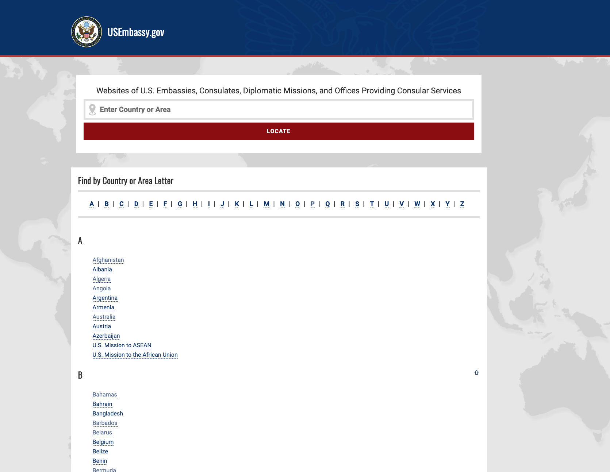
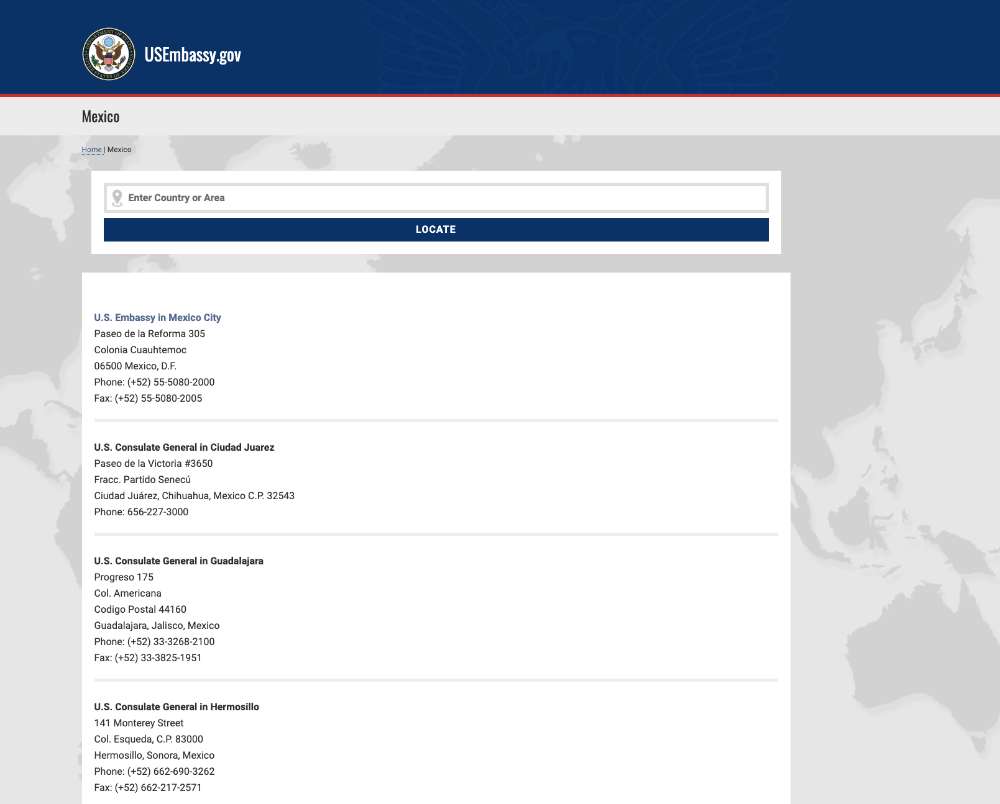

# US Embassy Site Scraper

## Background

This script is used to retrieve a list of contact information for all overseas missions. It was developed in support of the [travel alerts project](https://github.com/IIP-Design/travel-alerts) which required such a centralized list of contact information for all posts.

## Running the script

This script is written using the Go programming language. A user with [Go installed and configured](https://go.dev/doc/install) on their system can compile the script by running the `go build` command from within this directory.

This will compile the script into a binary file called `usembassyscraper`. The binary can then be executed by running `./usembassyscraper` from within this directory. Once script executes successfully, a CSV file called `post-contacts.csv` will be created, again, within this directory.

## Source

The script retrieves these values from the [USEmbassy.gov webpage](https://www.usembassy.gov/). This page displays an alphabetical list of all countries and missions as seen below:



Each of the countries in the list links to a sub-page that contains contact information for all the missions (ie. embassies and consulates) in that country. Some countries only have one mission some (like Mexico, shown below) have several.



## Page Features

There are two HTML structures used to display the contact information within each country page. Most pages wrap the contact information in a div with the class `cityname1`.

```html
<!-- Simplified HTML Case 1 -->
<div class="entry-content">
  <div class="cityname">
    <div class="cityname1">
      <a href="https://mx.usembassy.gov/" target="_blank" rel="noopener">
        <strong>U.S. Embassy in Mexico City</strong>
      </a>
      <br />
      Paseo de la Reforma 305<br />
      Colonia Cuauhtemoc<br />
      06500 Mexico, D.F.<br />
      Phone: (+52) 55-5080-2000<br />
      Fax: (+52) 55-5080-2005
    </div>
  </div>
</div>
```

In fewer cases, the `cityname1` div is omitted and the contact appears in a p tag directly under the div with the class `entry-content`. In this case we need to target only the first p tag in the `entry-content` div, otherwise we will add text from the second p tag - a hidden byline.

```html
<!-- Simplified HTML Case 2 -->
<div class="entry-content">
  <p>
    <a href="https://au.usembassy.gov/">
      <strong>U.S. Embassy in Canberra</strong>
    </a>
    <br />
    Moonah Place<br />
    Yarralumla, ACT 2600<br />
    Telephone: (02) 6214-5600
  </p>
  <!-- Unwanted byline below -->
  <p class="byline author vcard bottom-topics">By Author Name</p>
</div>
```

## Edge Cases

While the script takes these two formats into account, some posts are impacted by malformed HTML which pulls in extraneous content into the contact info. This is difficult to rectify in the script and given the limited occurrences, it is easier to clean up the final CSV file. Specifically, the following are posts impacted:

- Belarus
- Djibouti

Also note that when running this script as is, some of the values in the countries column are incorrect. This was not entirely unexpected as the `countryName` variable (found in `main.go` line 52) is set outside of the loop where the colly parses the scraped page's HTML. This was done to overcome a limitation in the way colly executes the page HTML and can probably be eliminated by reducing the parallel calls from 5 to 1 in `main.go` line 57. The parallelization was added to speed up the scraping by allowing multiple instantiations of the crawler, but is probably unnecessary.
